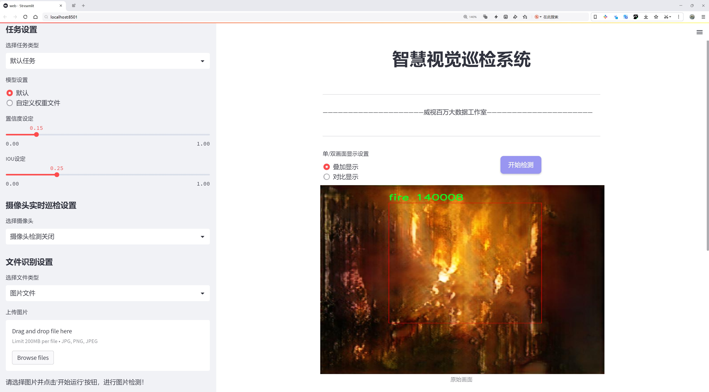
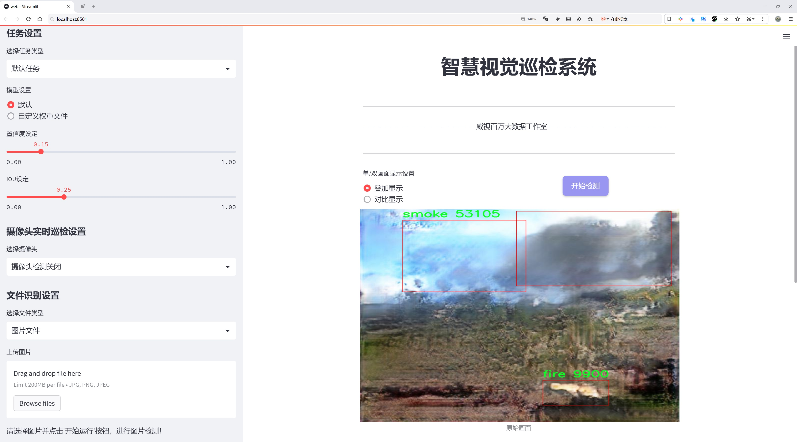
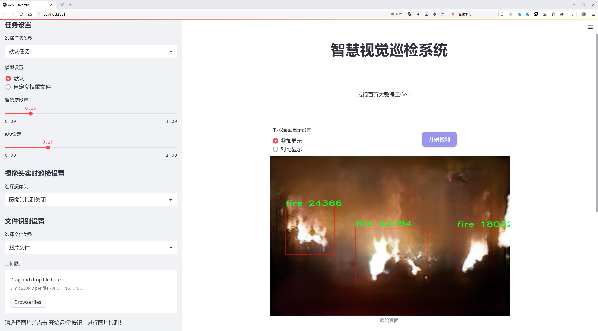
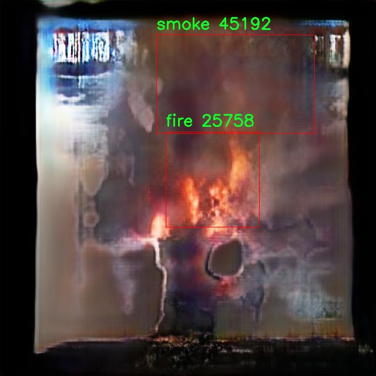
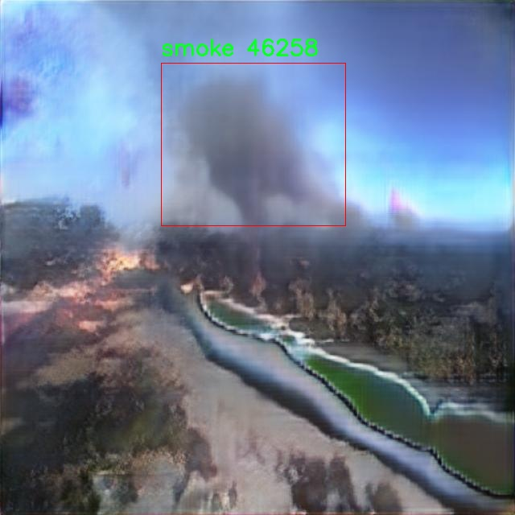
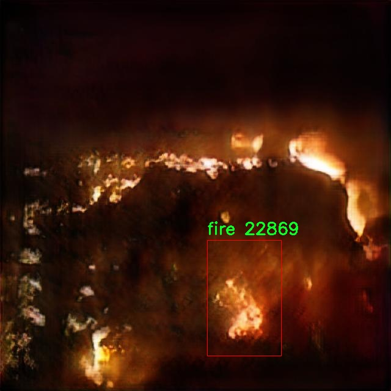
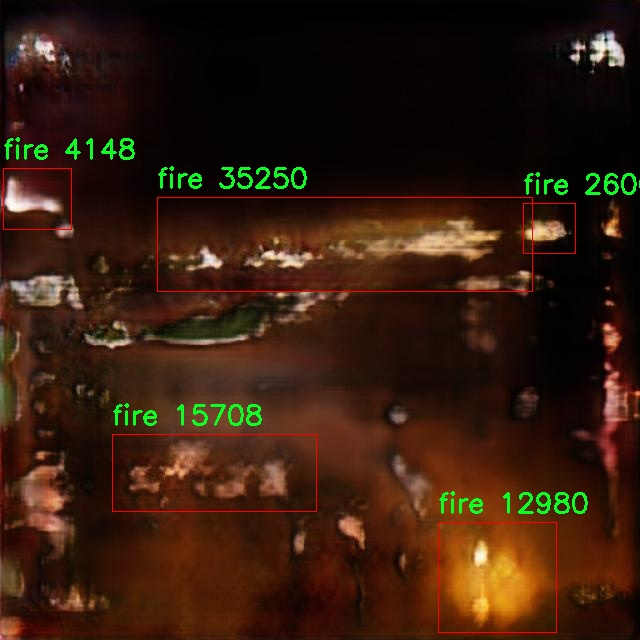
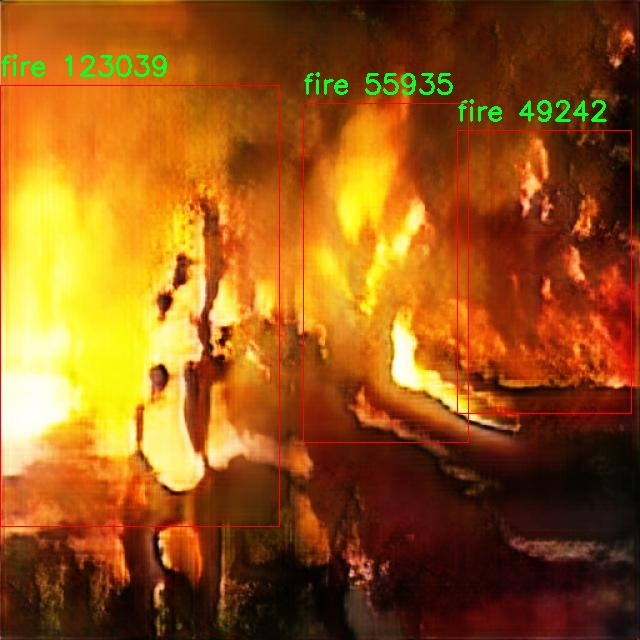

# 火灾烟雾目标检测检测系统源码分享
 # [一条龙教学YOLOV8标注好的数据集一键训练_70+全套改进创新点发刊_Web前端展示]

### 1.研究背景与意义

项目参考[AAAI Association for the Advancement of Artificial Intelligence](https://gitee.com/qunmasj/projects)

研究背景与意义

随着城市化进程的加快和工业化水平的提升，火灾事故的发生频率逐年上升，给人民生命财产安全带来了严重威胁。根据统计数据，火灾不仅造成了巨大的经济损失，还导致了大量的人员伤亡。因此，及时有效地检测火灾及其产生的烟雾，对于减少火灾损失、保护生命安全具有重要的现实意义。传统的火灾监测手段多依赖于人工巡查和固定监控设备，存在反应迟缓、覆盖范围有限等缺陷，难以满足现代社会对火灾预警的高效性和准确性的要求。

近年来，深度学习技术的迅猛发展为火灾检测提供了新的解决方案。YOLO（You Only Look Once）系列模型因其高效的实时目标检测能力而受到广泛关注。YOLOv8作为该系列的最新版本，具备更强的特征提取能力和更快的推理速度，能够在复杂环境中实现对火灾和烟雾的快速识别。然而，现有的YOLOv8模型在特定场景下的火灾烟雾检测性能仍有待提升，尤其是在多变的光照条件、不同的烟雾密度以及火焰形态等情况下，模型的鲁棒性和准确性亟需改进。

本研究旨在基于改进的YOLOv8模型，构建一个高效的火灾烟雾目标检测系统。为此，我们将使用包含2152张图像的火灾与烟雾检测数据集，该数据集涵盖了两个主要类别：火焰和烟雾。这一数据集的构建不仅为模型训练提供了丰富的样本，还为后续的模型评估和优化奠定了基础。通过对数据集的深入分析，我们将探索不同环境下火灾烟雾的特征表现，从而为模型的改进提供数据支持。

在研究过程中，我们将采用数据增强、迁移学习等技术，进一步提升YOLOv8模型在火灾烟雾检测中的性能。数据增强技术可以有效扩展训练样本的多样性，提高模型的泛化能力；而迁移学习则能够利用已有的知识，加速模型的训练过程，提升检测精度。通过这些改进，我们期望能够显著提高模型在实际应用中的表现，使其能够在复杂环境中快速、准确地识别火灾和烟雾。

本研究的意义不仅在于技术层面的创新，更在于其对社会安全的积极影响。通过构建高效的火灾烟雾检测系统，我们能够为火灾预警和应急响应提供强有力的技术支持，降低火灾带来的风险，保护人民的生命财产安全。此外，研究成果还可以为相关领域的研究提供借鉴，推动智能监控技术的发展，促进人工智能在公共安全领域的应用。因此，本研究具有重要的理论价值和现实意义，期待能够为火灾防控提供新的思路和方法。

### 2.图片演示







##### 注意：由于此博客编辑较早，上面“2.图片演示”和“3.视频演示”展示的系统图片或者视频可能为老版本，新版本在老版本的基础上升级如下：（实际效果以升级的新版本为准）

  （1）适配了YOLOV8的“目标检测”模型和“实例分割”模型，通过加载相应的权重（.pt）文件即可自适应加载模型。

  （2）支持“图片识别”、“视频识别”、“摄像头实时识别”三种识别模式。

  （3）支持“图片识别”、“视频识别”、“摄像头实时识别”三种识别结果保存导出，解决手动导出（容易卡顿出现爆内存）存在的问题，识别完自动保存结果并导出到。

  （4）支持Web前端系统中的标题、背景图等自定义修改，后面提供修改教程。

  另外本项目提供训练的数据集和训练教程,暂不提供权重文件（best.pt）,需要您按照教程进行训练后实现图片演示和Web前端界面演示的效果。

### 3.视频演示

[3.1 视频演示](https://www.bilibili.com/video/BV11NWyeDEoz/?vd_source=ff015de2d29cbe2a9cdbfa7064407a08)

### 4.数据集信息展示

数据集信息展示

本数据集专为改进YOLOv8的火灾烟雾目标检测系统而设计，旨在提升火灾和烟雾检测的准确性与效率。数据集的核心模块名为“火灾与烟雾检测”，包含了2152幅图像，这些图像均经过精心挑选，以确保涵盖多种环境和条件下的火灾与烟雾现象。数据集的设计不仅考虑了图像的数量，更注重图像的多样性，确保模型在训练过程中能够接触到不同类型的火灾和烟雾场景，从而提高其泛化能力。

在类别方面，本数据集设定了两个主要类别：火灾和烟雾。这两个类别的划分旨在帮助模型更清晰地识别和区分火灾与烟雾的特征，进而提高检测的准确性。火灾类别包括各种类型的火焰表现，如明火、火焰蔓延等，而烟雾类别则涵盖了不同浓度和颜色的烟雾表现，反映了火灾发生时可能出现的多种情境。这种细致的分类方式不仅增强了数据集的实用性，也为后续的模型训练提供了丰富的标注信息。

数据集的图像来源多样，涵盖了室内和室外场景，确保模型能够在不同的环境条件下进行有效的火灾和烟雾检测。这些图像不仅包括日常生活中可能遇到的火灾情景，还包括一些特殊情况下的火灾表现，如工业事故、森林火灾等。通过这种多样化的图像选择，模型能够更好地适应各种实际应用场景，提高其在真实环境中的应用效果。

此外，本数据集遵循CC BY 4.0许可证，允许用户在遵循相关条款的前提下自由使用、修改和分发数据集。这一开放的许可政策不仅促进了学术界和工业界的合作，也为研究人员和开发者提供了更多的灵活性，使他们能够在此基础上进行进一步的研究和开发。

总之，该数据集为火灾和烟雾检测领域的研究提供了一个强有力的基础，特别是在使用YOLOv8模型进行目标检测时。通过丰富的图像数据和清晰的类别划分，研究人员能够更有效地训练和优化模型，从而提升火灾和烟雾的检测能力，最终为公共安全和灾害管理提供更为可靠的技术支持。随着火灾和烟雾检测技术的不断进步，期待该数据集能够为相关领域的研究和应用带来积极的推动作用。











### 5.全套项目环境部署视频教程（零基础手把手教学）

[5.1 环境部署教程链接（零基础手把手教学）](https://www.ixigua.com/7404473917358506534?logTag=c807d0cbc21c0ef59de5)


[5.2 安装Python虚拟环境创建和依赖库安装视频教程链接（零基础手把手教学）](https://www.ixigua.com/7404474678003106304?logTag=1f1041108cd1f708b01a)

### 6.手把手YOLOV8训练视频教程（零基础小白有手就能学会）

[6.1 环境部署教程链接（零基础手把手教学）](https://www.ixigua.com/7404477157818401292?logTag=d31a2dfd1983c9668658)

### 7.70+种全套YOLOV8创新点代码加载调参视频教程（一键加载写好的改进模型的配置文件）

[7.1 环境部署教程链接（零基础手把手教学）](https://www.ixigua.com/7404478314661806627?logTag=29066f8288e3f4eea3a4)

### 8.70+种全套YOLOV8创新点原理讲解（非科班也可以轻松写刊发刊，V10版本正在科研待更新）

由于篇幅限制，每个创新点的具体原理讲解就不一一展开，具体见下列网址中的创新点对应子项目的技术原理博客网址【Blog】：


[8.1 70+种全套YOLOV8创新点原理讲解链接](https://gitee.com/qunmasj/good)

### 9.系统功能展示（检测对象为举例，实际内容以本项目数据集为准）

图1.系统支持检测结果表格显示

  图2.系统支持置信度和IOU阈值手动调节

  图3.系统支持自定义加载权重文件best.pt(需要你通过步骤5中训练获得)

  图4.系统支持摄像头实时识别

  图5.系统支持图片识别

  图6.系统支持视频识别

  图7.系统支持识别结果文件自动保存

  图8.系统支持Excel导出检测结果数据


### 10.原始YOLOV8算法原理

原始YOLOv8算法原理

YOLOv8算法是YOLO系列目标检测模型的最新进展，其设计理念和实现方法在前几代YOLO模型的基础上进行了深度优化和创新。作为一种高效的目标检测技术，YOLOv8不仅继承了YOLO系列的核心思想，还在多个方面进行了显著改进，以满足现代计算机视觉应用的需求。

首先，YOLOv8模型的结构由三个主要部分组成：输入端、主干网络（Backbone）和检测端（Head）。在YOLOv8中，主干网络采用了轻量化的C2F模块，这一模块取代了之前YOLOv5中的C3模块。C2F模块的设计旨在减少计算复杂度，同时保留丰富的特征信息。具体而言，C2F模块通过将输入特征图分为两个分支，分别经过卷积层进行降维，进而通过残差连接将多个分支的输出进行融合。这种设计不仅提高了特征提取的效率，还增强了模型对梯度信息的捕捉能力，使得模型在轻量化的同时，依然能够保持较高的检测性能。

在特征融合层，YOLOv8采用了特征金字塔网络（FPN）与路径聚合网络（PAN）的结合，这一结构的优势在于能够有效地处理不同尺度的特征信息。为了进一步提升特征融合的效率，YOLOv8引入了BiFPN网络，这一网络通过高效的双向跨尺度连接和加权特征融合，显著提高了模型对多尺度特征的提取速度。BiFPN的设计理念在于通过删除单输入对应的节点，并在同一层的输入输出节点之间添加连接，从而实现更为灵活和高效的特征融合。这种创新使得YOLOv8在处理复杂场景时，能够更好地捕捉到目标的多样性和变化性。

在检测头层，YOLOv8采用了当前流行的解耦合头结构，将目标分类和检测任务分离开来。这一设计的核心在于将Anchor-Based的检测方式替换为Anchor-Free的检测方式，直接预测目标的中心点及其宽高比例。这种方法不仅减少了Anchor框的数量，还提高了检测的速度和准确度。通过这种解耦合的方式，YOLOv8能够在不同的应用场景中，灵活应对各种目标检测任务，尤其是在实时性要求较高的场合。

在训练过程中，YOLOv8还采用了一些新的数据增强策略，以提升模型的泛化能力。例如，在训练的最后10个epoch中，关闭马赛克增强，并使用动态Task-Aligned Assigner样本分配策略，这些策略的引入使得模型在面对复杂背景和多样化目标时，能够更好地适应和学习。此外，YOLOv8在损失计算方面也进行了创新，采用了BCELoss作为分类损失，DFLLoss和CIoULoss作为回归损失，这一组合的损失函数设计旨在提升模型的训练效率和检测精度。

YOLOv8的轻量化设计使其能够在移动设备和边缘计算环境中高效运行，这一特性对于实际应用具有重要意义。通过优化网络结构和算法，YOLOv8在保证检测精度的同时，显著降低了计算资源的消耗，极大地提升了目标检测的实时性和可用性。

总的来说，YOLOv8算法通过引入C2F模块、BiFPN网络、解耦合头结构以及新的损失计算方法，展现了在目标检测领域的强大能力。其轻量化的设计和高效的特征提取与融合策略，使得YOLOv8不仅在学术研究中具有重要的理论价值，同时在实际应用中也展现出广泛的适用性。随着计算机视觉技术的不断发展，YOLOv8无疑将在未来的目标检测任务中发挥更加重要的作用。


### 11.项目核心源码讲解（再也不用担心看不懂代码逻辑）

#### 11.1 utils.py

以下是对代码的核心部分进行提炼和详细注释的结果：

```python
import os
import cv2
import pandas as pd
import streamlit as st
from PIL import Image
from QtFusion.path import abs_path

def save_uploaded_file(uploaded_file):
    """
    保存上传的文件到服务器上。

    Args:
        uploaded_file (UploadedFile): 通过Streamlit上传的文件。

    Returns:
        str: 保存文件的完整路径，如果没有文件上传则返回 None。
    """
    # 检查是否有文件上传
    if uploaded_file is not None:
        base_path = "tempDir"  # 定义文件保存的基本路径

        # 如果路径不存在，创建这个路径
        if not os.path.exists(base_path):
            os.makedirs(base_path)
        
        # 获取文件的完整路径
        file_path = os.path.join(base_path, uploaded_file.name)

        # 以二进制写模式打开文件并写入
        with open(file_path, "wb") as f:
            f.write(uploaded_file.getbuffer())  # 将上传的文件内容写入到指定路径

        return file_path  # 返回文件路径

    return None  # 如果没有文件上传，返回 None


def concat_results(result, location, confidence, time):
    """
    显示检测结果。

    Args:
        result (str): 检测结果。
        location (str): 检测位置。
        confidence (str): 置信度。
        time (str): 检测用时。

    Returns:
        DataFrame: 包含检测结果的 DataFrame。
    """
    # 创建一个包含检测信息的字典
    result_data = {
        "识别结果": [result],
        "位置": [location],
        "置信度": [confidence],
        "用时": [time]
    }

    # 将字典转换为 DataFrame 以便于展示
    results_df = pd.DataFrame(result_data)
    return results_df


def get_camera_names():
    """
    获取可用摄像头名称列表。

    Returns:
        list: 返回包含“未启用摄像头”和可用摄像头索引号的列表。
    """
    camera_names = ["摄像头检测关闭", "0"]  # 初始化摄像头名称列表
    max_test_cameras = 10  # 定义要测试的最大摄像头数量

    # 循环检测摄像头
    for i in range(max_test_cameras):
        cap = cv2.VideoCapture(i, cv2.CAP_DSHOW)  # 尝试打开摄像头
        if cap.isOpened() and str(i) not in camera_names:  # 如果摄像头打开成功且未在列表中
            camera_names.append(str(i))  # 添加摄像头索引到列表
            cap.release()  # 释放摄像头资源

    # 如果没有找到可用的摄像头，输出提示信息
    if len(camera_names) == 1:
        st.write("未找到可用的摄像头")
    
    return camera_names  # 返回摄像头名称列表
```

### 核心部分说明：
1. **文件上传与保存**：`save_uploaded_file` 函数负责处理用户上传的文件，并将其保存到服务器的指定目录中。
2. **结果展示**：`concat_results` 函数将检测结果整理成一个 Pandas DataFrame，方便后续展示。
3. **摄像头检测**：`get_camera_names` 函数通过 OpenCV 检测可用的摄像头，并返回其名称列表，确保用户能够选择可用的摄像头进行操作。

这个 `utils.py` 文件包含了一些用于处理文件上传、显示检测结果、加载默认图片以及获取可用摄像头名称的实用函数。首先，文件引入了必要的库，包括 `os`、`cv2`、`pandas`、`streamlit`、`PIL` 和 `QtFusion.path`。

在文件中，`save_uploaded_file` 函数用于保存用户通过 Streamlit 上传的文件。它首先检查是否有文件上传，如果有，则定义一个基本路径 `tempDir` 用于存储文件。如果该路径不存在，函数会创建这个路径。接着，函数会获取上传文件的完整路径，并以二进制写模式打开文件，将其内容写入指定路径。最后，函数返回保存文件的完整路径，如果没有文件上传，则返回 `None`。

接下来，`concat_results` 函数用于显示检测结果。它接收检测结果、位置、置信度和检测用时作为参数，并将这些信息组织成一个 Pandas DataFrame。这个 DataFrame 包含四列，分别是“识别结果”、“位置”、“置信度”和“用时”，最后返回这个 DataFrame。

`load_default_image` 函数用于加载一个默认的图片。它通过调用 `abs_path` 函数获取默认图片的绝对路径，然后使用 `Image.open` 打开并返回这个图片对象。

最后，`get_camera_names` 函数用于获取可用摄像头的名称列表。它初始化一个包含“摄像头检测关闭”和索引“0”的列表，并定义一个最大测试摄像头数量的变量。函数通过循环测试从 0 到最大数量的摄像头，使用 `cv2.VideoCapture` 检查每个摄像头是否可用。如果可用，则将其索引添加到摄像头名称列表中。若在循环结束后仍未找到可用摄像头，函数会通过 Streamlit 输出一条提示信息。最终，函数返回包含可用摄像头名称的列表。

整体来看，这个文件提供了一些基础的工具函数，方便在一个基于 Streamlit 的应用中处理文件上传、显示结果、加载图片和获取摄像头信息。

#### 11.2 ultralytics\models\utils\loss.py

以下是代码中最核心的部分，并附上详细的中文注释：

```python
import torch
import torch.nn as nn
import torch.nn.functional as F
from ultralytics.utils.loss import FocalLoss, VarifocalLoss
from ultralytics.utils.metrics import bbox_iou
from .ops import HungarianMatcher

class DETRLoss(nn.Module):
    """
    DETR (DEtection TRansformer) 损失类。该类计算并返回DETR目标检测模型的不同损失组件。
    计算分类损失、边界框损失、GIoU损失，并可选择性地计算辅助损失。
    """

    def __init__(self, nc=80, loss_gain=None, aux_loss=True, use_fl=True, use_vfl=False):
        """
        初始化DETR损失函数。

        参数:
            nc (int): 类别数量。
            loss_gain (dict): 各损失组件的系数。
            aux_loss (bool): 是否计算辅助损失。
            use_fl (bool): 是否使用FocalLoss。
            use_vfl (bool): 是否使用VarifocalLoss。
        """
        super().__init__()

        # 如果没有提供损失系数，则使用默认值
        if loss_gain is None:
            loss_gain = {"class": 1, "bbox": 5, "giou": 2}
        self.nc = nc  # 类别数量
        self.matcher = HungarianMatcher(cost_gain={"class": 2, "bbox": 5, "giou": 2})  # 匹配器
        self.loss_gain = loss_gain  # 损失系数
        self.aux_loss = aux_loss  # 是否计算辅助损失
        self.fl = FocalLoss() if use_fl else None  # Focal Loss对象
        self.vfl = VarifocalLoss() if use_vfl else None  # Varifocal Loss对象
        self.device = None  # 设备信息

    def _get_loss_class(self, pred_scores, targets, gt_scores, num_gts):
        """计算分类损失。"""
        bs, nq = pred_scores.shape[:2]  # 获取批次大小和查询数量
        one_hot = torch.zeros((bs, nq, self.nc + 1), dtype=torch.int64, device=targets.device)  # 创建one-hot编码
        one_hot.scatter_(2, targets.unsqueeze(-1), 1)  # 将目标值转换为one-hot编码
        one_hot = one_hot[..., :-1]  # 去掉最后一列

        gt_scores = gt_scores.view(bs, nq, 1) * one_hot  # 计算ground truth分数

        # 使用Focal Loss或Varifocal Loss计算分类损失
        if self.fl:
            if num_gts and self.vfl:
                loss_cls = self.vfl(pred_scores, gt_scores, one_hot)
            else:
                loss_cls = self.fl(pred_scores, one_hot.float())
            loss_cls /= max(num_gts, 1) / nq  # 标准化损失
        else:
            loss_cls = nn.BCEWithLogitsLoss(reduction="none")(pred_scores, gt_scores).mean(1).sum()  # 计算BCE损失

        return {"loss_class": loss_cls.squeeze() * self.loss_gain["class"]}  # 返回分类损失

    def _get_loss_bbox(self, pred_bboxes, gt_bboxes):
        """计算边界框损失和GIoU损失。"""
        loss = {}
        if len(gt_bboxes) == 0:  # 如果没有ground truth边界框
            loss["loss_bbox"] = torch.tensor(0.0, device=self.device)
            loss["loss_giou"] = torch.tensor(0.0, device=self.device)
            return loss

        # 计算L1损失和GIoU损失
        loss["loss_bbox"] = self.loss_gain["bbox"] * F.l1_loss(pred_bboxes, gt_bboxes, reduction="sum") / len(gt_bboxes)
        loss["loss_giou"] = 1.0 - bbox_iou(pred_bboxes, gt_bboxes, xywh=True, GIoU=True)
        loss["loss_giou"] = loss["loss_giou"].sum() / len(gt_bboxes)
        loss["loss_giou"] = self.loss_gain["giou"] * loss["loss_giou"]
        return {k: v.squeeze() for k, v in loss.items()}  # 返回边界框损失和GIoU损失

    def _get_loss(self, pred_bboxes, pred_scores, gt_bboxes, gt_cls):
        """计算所有损失。"""
        match_indices = self.matcher(pred_bboxes, pred_scores, gt_bboxes, gt_cls)  # 获取匹配索引
        idx, gt_idx = self._get_index(match_indices)  # 获取索引
        pred_bboxes, gt_bboxes = pred_bboxes[idx], gt_bboxes[gt_idx]  # 根据索引获取预测和真实边界框

        # 创建目标张量
        bs, nq = pred_scores.shape[:2]
        targets = torch.full((bs, nq), self.nc, device=pred_scores.device, dtype=gt_cls.dtype)
        targets[idx] = gt_cls[gt_idx]  # 填充目标张量

        gt_scores = torch.zeros([bs, nq], device=pred_scores.device)  # 创建ground truth分数张量
        if len(gt_bboxes):
            gt_scores[idx] = bbox_iou(pred_bboxes.detach(), gt_bboxes, xywh=True).squeeze(-1)  # 计算IoU

        loss = {}
        loss.update(self._get_loss_class(pred_scores, targets, gt_scores, len(gt_bboxes)))  # 计算分类损失
        loss.update(self._get_loss_bbox(pred_bboxes, gt_bboxes))  # 计算边界框损失
        return loss  # 返回所有损失

    def forward(self, pred_bboxes, pred_scores, batch):
        """
        前向传播，计算损失。

        参数:
            pred_bboxes (torch.Tensor): 预测的边界框。
            pred_scores (torch.Tensor): 预测的分数。
            batch (dict): 包含ground truth信息的字典。
        """
        self.device = pred_bboxes.device  # 设置设备
        gt_cls, gt_bboxes = batch["cls"], batch["bboxes"]  # 获取ground truth类和边界框

        total_loss = self._get_loss(pred_bboxes[-1], pred_scores[-1], gt_bboxes, gt_cls)  # 计算总损失
        return total_loss  # 返回总损失
```

### 代码说明：
1. **DETRLoss类**：负责计算DETR模型的损失，包括分类损失、边界框损失和GIoU损失。
2. **初始化方法**：设置类别数量、损失系数、是否使用Focal Loss和Varifocal Loss等参数。
3. **_get_loss_class方法**：计算分类损失，使用one-hot编码和Focal Loss或BCE损失。
4. **_get_loss_bbox方法**：计算边界框损失和GIoU损失。
5. **_get_loss方法**：整合分类损失和边界框损失的计算。
6. **forward方法**：执行前向传播，计算并返回总损失。

该代码实现了DETR模型的损失计算逻辑，核心在于如何根据预测结果和真实标签计算不同的损失，并在训练过程中优化模型。

这个程序文件定义了一个用于目标检测模型的损失计算类，主要是针对DETR（DEtection TRansformer）模型的损失函数。文件中包含了两个主要的类：`DETRLoss`和`RTDETRDetectionLoss`，它们分别用于计算DETR模型和RT-DETR模型的损失。

`DETRLoss`类是一个继承自`nn.Module`的类，主要负责计算DETR模型的各种损失，包括分类损失、边界框损失、广义IoU（GIoU）损失，以及可选的辅助损失。该类的构造函数接受多个参数，如类别数量、损失系数、是否使用Focal Loss和Varifocal Loss等。损失系数用于调整不同损失的权重，以便在训练过程中更好地平衡各个损失的影响。

在`DETRLoss`类中，有多个私有方法用于计算不同类型的损失。例如，`_get_loss_class`方法计算分类损失，`_get_loss_bbox`方法计算边界框损失和GIoU损失，`_get_loss_aux`方法计算辅助损失。每个损失计算方法都根据模型的预测结果和真实标签来计算损失值，并根据需要进行归一化处理。

此外，`_get_loss`方法是一个综合性的方法，它调用其他损失计算方法，并整合所有损失的结果。`forward`方法是类的入口，负责接收模型的预测结果和真实标签，并返回总损失。

`RTDETRDetectionLoss`类继承自`DETRLoss`，用于计算RT-DETR模型的损失。它在`forward`方法中增加了对去噪训练损失的计算，允许在提供去噪元数据的情况下计算额外的损失。

总的来说，这个文件的主要功能是定义和实现DETR及其变种模型的损失计算逻辑，为模型的训练提供必要的损失反馈，以优化模型的性能。

#### 11.3 ui.py

```python
import sys
import subprocess

def run_script(script_path):
    """
    使用当前 Python 环境运行指定的脚本。

    Args:
        script_path (str): 要运行的脚本路径

    Returns:
        None
    """
    # 获取当前 Python 解释器的路径
    python_path = sys.executable

    # 构建运行命令
    command = f'"{python_path}" -m streamlit run "{script_path}"'

    # 执行命令
    result = subprocess.run(command, shell=True)
    if result.returncode != 0:
        print("脚本运行出错。")


# 实例化并运行应用
if __name__ == "__main__":
    # 指定您的脚本路径
    script_path = "web.py"  # 这里直接指定脚本路径

    # 运行脚本
    run_script(script_path)
```

### 代码核心部分及详细注释

1. **导入必要的模块**：
   - `sys`: 用于访问与 Python 解释器相关的变量和函数。
   - `subprocess`: 用于执行外部命令。

2. **定义 `run_script` 函数**：
   - 该函数接受一个参数 `script_path`，表示要运行的 Python 脚本的路径。
   - 函数内部首先获取当前 Python 解释器的路径，确保在正确的环境中运行脚本。

3. **构建运行命令**：
   - 使用 f-string 格式化字符串，构建出执行脚本的命令。命令的格式为：`"{python_path}" -m streamlit run "{script_path}"`，其中 `-m streamlit run` 是用于运行 Streamlit 应用的命令。

4. **执行命令**：
   - 使用 `subprocess.run` 方法执行构建好的命令。`shell=True` 参数允许在 shell 中执行命令。
   - 检查命令的返回码，如果返回码不为 0，表示脚本运行出错，打印错误信息。

5. **主程序入口**：
   - 使用 `if __name__ == "__main__":` 确保该部分代码仅在直接运行该脚本时执行。
   - 指定要运行的脚本路径 `script_path`，这里直接设置为 `"web.py"`。
   - 调用 `run_script` 函数，传入脚本路径以运行该脚本。

这个程序文件的主要功能是使用当前的 Python 环境来运行一个指定的脚本，具体是一个名为 `web.py` 的文件。程序首先导入了必要的模块，包括 `sys`、`os` 和 `subprocess`，这些模块分别用于获取系统信息、处理文件路径和执行外部命令。

在 `run_script` 函数中，首先获取当前 Python 解释器的路径，这通过 `sys.executable` 实现。接着，构建一个命令字符串，这个命令使用 `streamlit` 模块来运行指定的脚本。`streamlit` 是一个用于构建数据应用的流行库。命令的格式是 `"{python_path}" -m streamlit run "{script_path}"`，其中 `python_path` 是当前 Python 解释器的路径，`script_path` 是要运行的脚本的路径。

随后，使用 `subprocess.run` 方法来执行这个命令。这个方法会在一个新的 shell 中运行命令，并返回一个结果对象。通过检查 `result.returncode`，可以判断脚本是否成功运行。如果返回码不为 0，表示脚本运行出错，此时会打印出相应的错误信息。

在文件的最后部分，使用 `if __name__ == "__main__":` 语句来确保只有在直接运行该文件时才会执行下面的代码。在这里，指定了要运行的脚本路径 `web.py`，并调用 `run_script` 函数来执行这个脚本。

整体来看，这个程序提供了一种简单的方式来启动一个基于 Streamlit 的 Web 应用，方便用户在命令行中直接运行指定的 Python 脚本。

#### 11.4 train.py

以下是代码中最核心的部分，并附上详细的中文注释：

```python
import os
import torch
import yaml
from ultralytics import YOLO  # 导入YOLO模型
from QtFusion.path import abs_path  # 导入路径处理工具

# 设置设备为GPU（如果可用），否则使用CPU
device = "0" if torch.cuda.is_available() else "cpu"

if __name__ == '__main__':  # 确保该模块被直接运行时才执行以下代码
    workers = 1  # 设置数据加载的工作进程数
    batch = 2    # 设置每个批次的大小

    data_name = "data"  # 数据集名称
    # 获取数据集的yaml配置文件的绝对路径
    data_path = abs_path(f'datasets/{data_name}/{data_name}.yaml', path_type='current')  
    unix_style_path = data_path.replace(os.sep, '/')  # 将路径转换为Unix风格

    # 获取目录路径
    directory_path = os.path.dirname(unix_style_path)
    
    # 读取YAML文件，保持原有顺序
    with open(data_path, 'r') as file:
        data = yaml.load(file, Loader=yaml.FullLoader)
    
    # 修改YAML文件中的path项为当前目录路径
    if 'path' in data:
        data['path'] = directory_path
        # 将修改后的数据写回YAML文件
        with open(data_path, 'w') as file:
            yaml.safe_dump(data, file, sort_keys=False)

    # 加载预训练的YOLOv8模型
    model = YOLO(model='./ultralytics/cfg/models/v8/yolov8s.yaml', task='detect')  
    
    # 开始训练模型
    results2 = model.train(  
        data=data_path,  # 指定训练数据的配置文件路径
        device=device,  # 使用之前设置的设备
        workers=workers,  # 使用指定的工作进程数
        imgsz=640,  # 指定输入图像的大小为640x640
        epochs=100,  # 指定训练100个epoch
        batch=batch,  # 指定每个批次的大小
        name='train_v8_' + data_name  # 指定训练任务的名称
    )
```

### 代码注释说明：
1. **导入库**：导入必要的库，包括操作系统处理、PyTorch、YAML解析和YOLO模型。
2. **设备选择**：根据是否有可用的GPU来选择设备，优先使用GPU。
3. **主程序入口**：确保代码在直接运行时执行。
4. **参数设置**：设置数据加载的工作进程数和批次大小。
5. **数据集路径**：构建数据集的YAML配置文件的绝对路径，并转换为Unix风格路径。
6. **读取和修改YAML文件**：读取YAML文件内容，修改其中的`path`项为当前目录路径，并将修改后的内容写回文件。
7. **模型加载**：加载YOLOv8的预训练模型。
8. **模型训练**：开始训练模型，指定训练数据、设备、工作进程数、图像大小、训练轮数和任务名称等参数。

该程序文件`train.py`的主要功能是使用YOLOv8模型进行目标检测的训练。首先，程序导入了必要的库，包括`os`、`torch`、`yaml`和`ultralytics`中的YOLO模型。接着，程序判断当前是否可以使用GPU，如果可以，则将设备设置为"0"（即使用第一个GPU），否则使用CPU。

在`__main__`模块中，程序设置了一些训练参数，包括工作进程数（`workers`）和批次大小（`batch`）。接下来，程序定义了数据集的名称，这里使用的是`data`，并构建了数据集配置文件的绝对路径。使用`abs_path`函数来获取该路径，并将系统路径分隔符替换为Unix风格的斜杠，以确保在不同操作系统上都能正确处理路径。

程序随后获取数据集目录的路径，并打开指定的YAML文件以读取数据集的配置。通过`yaml.load`函数读取YAML文件的内容，并保持原有的顺序。接着，程序检查YAML文件中是否包含`path`项，如果有，则将其修改为数据集的目录路径，并将更新后的内容写回到YAML文件中。

接下来，程序加载YOLOv8模型，指定了模型的配置文件路径，并设置任务为目标检测。然后，程序调用`model.train`方法开始训练模型，传入了一系列参数，包括数据配置文件路径、设备、工作进程数、输入图像大小（640x640）、训练的epoch数量（100）以及训练任务的名称。

总的来说，该程序通过配置和训练YOLOv8模型，旨在实现对指定数据集的目标检测训练。

#### 11.5 ultralytics\models\yolo\__init__.py

以下是经过简化并添加详细中文注释的核心代码部分：

```python
# 导入Ultralytics YOLO模型的相关功能
from ultralytics.models.yolo import classify, detect, obb, pose, segment

# 从当前模块导入YOLO类
from .model import YOLO

# 定义模块的公开接口，允许外部访问的功能
__all__ = "classify", "segment", "detect", "pose", "obb", "YOLO"
```

### 代码注释说明：

1. **导入模型功能**：
   - `from ultralytics.models.yolo import classify, detect, obb, pose, segment`：这一行代码从Ultralytics的YOLO模型库中导入了多个功能模块，包括分类（classify）、检测（detect）、方向边界框（obb）、姿态估计（pose）和分割（segment）。这些功能是YOLO模型的核心应用，用于处理不同类型的计算机视觉任务。

2. **导入YOLO类**：
   - `from .model import YOLO`：这一行代码从当前模块的`model`文件中导入了YOLO类。YOLO类通常用于创建YOLO模型的实例，并提供模型的训练和推理功能。

3. **定义公开接口**：
   - `__all__ = "classify", "segment", "detect", "pose", "obb", "YOLO"`：这一行代码定义了模块的公开接口，指定了哪些名称可以被外部导入。当使用`from module import *`时，只有在`__all__`中列出的名称会被导入。这有助于控制模块的可见性和避免命名冲突。

这个程序文件是Ultralytics YOLO模型的初始化文件，文件名为`__init__.py`，它的主要作用是定义该模块的公共接口。

首先，文件顶部的注释部分表明了这是Ultralytics YOLO项目的一部分，并且该项目遵循AGPL-3.0许可证。这意味着用户可以自由使用、修改和分发该软件，但必须在相同的许可证下进行。

接下来，文件通过`from`语句导入了多个功能模块，包括`classify`（分类）、`detect`（检测）、`obb`（有向边界框）、`pose`（姿态估计）和`segment`（分割）。这些模块提供了YOLO模型的不同功能，用户可以根据需要选择使用。

然后，文件还导入了`YOLO`类，这个类可能是YOLO模型的核心实现，用户可以通过这个类来创建和操作YOLO模型实例。

最后，`__all__`变量被定义为一个元组，包含了模块中希望公开的所有名称。这意味着当使用`from ultralytics.models.yolo import *`语句时，只有这些名称会被导入。这种做法有助于控制模块的公共接口，避免不必要的名称冲突和混淆。

总体来说，这个文件的主要功能是组织和导出YOLO模型的相关功能模块，使得用户可以方便地使用这些功能。

#### 11.6 ultralytics\models\yolo\obb\__init__.py

```python
# Ultralytics YOLO 🚀, AGPL-3.0 license

# 从当前模块导入 OBBPredictor、OBBTrainer 和 OBBValidator 类
from .predict import OBBPredictor
from .train import OBBTrainer
from .val import OBBValidator

# 定义当前模块的公共接口，指定可以被外部访问的类
__all__ = "OBBPredictor", "OBBTrainer", "OBBValidator"
```

### 代码详细注释：
1. **模块导入**：
   - `from .predict import OBBPredictor`：从当前包的 `predict` 模块中导入 `OBBPredictor` 类，通常用于目标检测的预测功能。
   - `from .train import OBBTrainer`：从当前包的 `train` 模块中导入 `OBBTrainer` 类，负责模型的训练过程。
   - `from .val import OBBValidator`：从当前包的 `val` 模块中导入 `OBBValidator` 类，用于模型的验证和评估。

2. **公共接口定义**：
   - `__all__ = "OBBPredictor", "OBBTrainer", "OBBValidator"`：这个特殊变量 `__all__` 用于定义当前模块的公共接口，指定了哪些类可以被外部导入。当使用 `from module import *` 时，只会导入 `__all__` 中列出的类。这样可以控制模块的可见性，避免不必要的名称冲突。

这个程序文件是Ultralytics YOLO模型的一部分，主要用于目标检测任务。文件名为`__init__.py`，它的存在表明该目录是一个Python包。在这个文件中，首先有一个注释，指出这是Ultralytics YOLO项目的一部分，并且使用的是AGPL-3.0许可证。

接下来，文件通过`from`语句导入了三个类：`OBBPredictor`、`OBBTrainer`和`OBBValidator`。这些类分别负责不同的功能：`OBBPredictor`用于进行目标检测的预测，`OBBTrainer`用于训练模型，而`OBBValidator`则用于验证模型的性能。

最后，`__all__`变量被定义为一个元组，包含了这三个类的名称。这意味着当使用`from <module> import *`语句时，只会导入这三个类，确保了模块的命名空间的清晰性和可控性。

总体来说，这个文件的主要作用是组织和管理与OBB（Oriented Bounding Box）相关的功能模块，使得在其他地方使用这些功能时更加方便。

### 12.系统整体结构（节选）

### 程序整体功能和构架概括

该程序是一个基于Ultralytics YOLO模型的目标检测框架，旨在提供一整套工具和功能，以便于用户进行目标检测模型的训练、评估和部署。程序的结构清晰，模块化设计使得各个功能之间的耦合度较低，便于维护和扩展。

主要功能模块包括：

1. **工具函数（utils.py）**：提供了一些实用的功能，如文件上传、结果显示、图片加载和摄像头信息获取。
2. **损失计算（loss.py）**：定义了YOLO模型的损失函数，负责计算训练过程中模型的损失值。
3. **用户界面（ui.py）**：负责启动Streamlit应用，提供用户与模型交互的界面。
4. **训练模块（train.py）**：实现了YOLO模型的训练过程，包括数据集配置和模型训练的设置。
5. **YOLO模型初始化（ultralytics/models/yolo/__init__.py）**：导入YOLO模型的核心功能和模块。
6. **有向边界框模块（ultralytics/models/yolo/obb/__init__.py）**：组织与有向边界框（OBB）相关的功能模块。
7. **其他模块（如val.py和utils/__init__.py）**：提供额外的功能和工具，支持模型的验证和其他实用功能。

### 文件功能整理表

| 文件路径                                      | 功能描述                                                 |
|-----------------------------------------------|----------------------------------------------------------|
| `utils.py`                                   | 提供文件上传、结果显示、加载默认图片和获取摄像头信息的实用函数。 |
| `ultralytics/models/utils/loss.py`          | 定义YOLO模型的损失计算类，包括DETR和RT-DETR模型的损失。     |
| `ui.py`                                      | 启动Streamlit应用，提供用户与模型交互的界面。                |
| `train.py`                                   | 负责YOLO模型的训练过程，包括数据集配置和训练参数设置。       |
| `ultralytics/models/yolo/__init__.py`       | 导入YOLO模型的核心功能和模块，定义公共接口。                 |
| `ultralytics/models/yolo/obb/__init__.py`   | 组织与有向边界框（OBB）相关的功能模块。                     |
| `ultralytics/assets/__init__.py`            | （假设）可能用于管理与模型相关的资源文件，如权重文件、配置文件等。 |
| `ultralytics/utils/__init__.py`             | （假设）可能用于导入与模型相关的实用工具函数。               |
| `ultralytics/models/yolo/obb/val.py`        | （假设）实现模型验证功能，评估模型在验证集上的性能。         |
| `ultralytics/utils/loss.py`                 | （假设）定义其他类型的损失函数，供不同模型使用。             |

> 注：对于`ultralytics/assets/__init__.py`、`ultralytics/utils/__init__.py`和`ultralytics/models/yolo/obb/val.py`的具体功能，由于没有提供详细的代码分析，功能描述为假设，实际功能可能需要根据具体实现进行确认。

注意：由于此博客编辑较早，上面“11.项目核心源码讲解（再也不用担心看不懂代码逻辑）”中部分代码可能会优化升级，仅供参考学习，完整“训练源码”、“Web前端界面”和“70+种创新点源码”以“13.完整训练+Web前端界面+70+种创新点源码、数据集获取”的内容为准。

### 13.完整训练+Web前端界面+70+种创新点源码、数据集获取


#完整训练+Web前端界面+70+种创新点源码、数据集获取链接
https://mbd.pub/o/bread/ZpqVlJ9u
